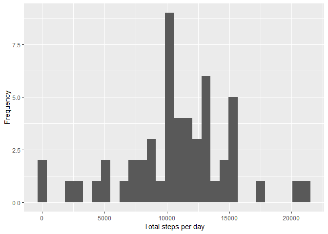

## Loading and preprocessing the data


```r
## Read csv
activity <- read.csv("activity.csv")
```


## What is mean total number of steps taken per day?

```r
## Omit missing values
activity_complete_data <- na.omit(activity)
## Steps taken per day
activity_per_day <- group_by(activity_complete_data, date)
activity_per_day <- summarize(activity_per_day, steps=sum(steps))
## Plot histogram
qplot(steps, data=activity_per_day, xlab='Total steps per day', ylab='Frequency')
```

<!-- -->

```r
## Mean and Median
steps_per_day_mean <- format(mean(activity_per_day$steps), nsmall = 2)
steps_per_day_median <- format(median(activity_per_day$steps), nsmall = 2)
```
* Mean : 10766.19
* Median : 10765


## What is the average daily activity pattern?

```r
## Activity per interval of 5 mins
activity_per_interval <- group_by(activity_complete_data, interval)
activity_per_interval <- summarize(activity_per_interval, steps=mean(steps))
## plot time series
ggplot(activity_per_interval, aes(interval, steps)) + geom_line()
```

<!-- -->

```r
## Max steps
max_steps <- max(activity_per_interval$steps)
```
* Max steps : 206.1698113


## Imputing missing values

```r
## Total number of rows with NA's
number_rows_NAs <- nrow(activity)-nrow(activity_complete_data)
## Merge activity per interval set with raw set
names(activity_per_interval)[2] <- "mean"
activity_imputed <- merge(activity, activity_per_interval)
## Convert Na's to mean number of steps
activity_imputed$steps[is.na(activity_imputed$steps)] <- activity_imputed$mean[is.na(activity_imputed$steps)]
## Activity per day for imputed dataset
activity_per_day_imputed <- group_by(activity_imputed, date)
activity_per_day_imputed <- summarize(activity_per_day_imputed, steps=sum(steps))
## Plot histogram
qplot(steps, data=activity_per_day_imputed)
```

<!-- -->

```r
## Mean and Median
steps_per_day_mean_imputed <- format(mean(activity_per_day_imputed$steps), nsmall = 2)
steps_per_day_median_imputed <- format(median(activity_per_day_imputed$steps), nsmall = 2)
```
* Mean : 10766.19
* Median : 10766.19


## Are there differences in activity patterns between weekdays and weekends?

```r
##
activity_imputed$dayofweek <- weekdays(as.Date(activity_imputed$date))
activity_imputed$weekend <-as.factor(activity_imputed$dayofweek=="Saturday"|activity_imputed$dayofweek=="Sunday")
levels(activity_imputed$weekend) <- c("Weekday", "Weekend")
## Segregate weekdays and weekends
activity_on_weekday <- activity_imputed[activity_imputed$weekend=="Weekday",]
activity_on_weekend <- activity_imputed[activity_imputed$weekend=="Weekend",]
## Group data
activity_per_interval_weekday <- group_by(activity_on_weekday, interval)
activity_per_interval_weekday <- summarize(activity_per_interval_weekday, steps=mean(steps))
activity_per_interval_weekday$weekend <- "Weekday"
activity_per_interval_weekend <- group_by(activity_on_weekend, interval)
activity_per_interval_weekend <- summarize(activity_per_interval_weekend, steps=mean(steps))
activity_per_interval_weekend$weekend <- "Weekend"
## plot graphs
avtivity_int <- rbind(activity_per_interval_weekday, activity_per_interval_weekend)
avtivity_int$weekend <- as.factor(avtivity_int$weekend)
ggplot(avtivity_int, aes(interval, steps)) + geom_line() + facet_grid(weekend ~ .)
```

<!-- -->

